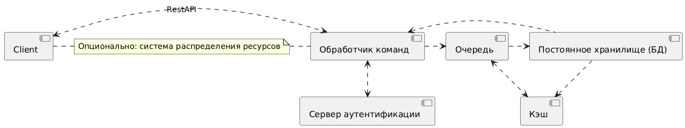
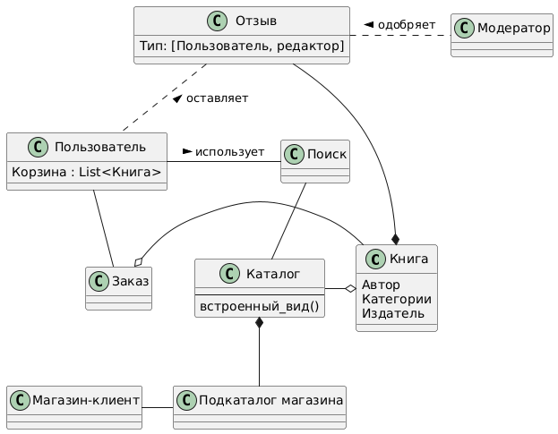

# Веб магазин книг

## Общие сведения о системе

Система представляет собой интернет-магазин книг, обеспечивающий взаимодействие пользователей
с каталогом книг, оплату заказов, а также дополнительные услуги, например, список желани и отзывов на книги.

## Architectural drivers

Функциональные требования:

* Поиск книг по заголовку, автору, ключевому слову, категории.

* Оплата заказов кредитной картой или по счету.

* Управление списком желаний.

* Возможность добавления книг в онлайн-корзину и их удаления.

* Модерация отзывов и оценок.

Нефункциональные требования:

* Масштабируемость для 1 млн пользователей.

* Обслуживание до 10 тыс. запросов в минуту через 6 месяцев после запуска.

* Интеграция с другими системами через XML.

## Роли и случаи использования

### Роли

* Покупатель.

* Администратор.

* Партнер.

* Сторонний продавец.

### Случаи использования:

####  Заказ книги через корзину.

- Пользователь добавляет одну или несколько книг в корзину.

- Проверяет содержимое корзины, изменяет количество книг или удаляет ненужные позиции.

- Переходит к оформлению заказа, где вводит или выбирает сохраненные данные (адрес доставки, платежные данные).

- Выбирает способ оплаты: кредитная карта или счет.

- Подтверждает заказ.

##### Альтернативные пути:

- Отмена оформления заказа на любом этапе до подтверждения.

- Сохранение текущей корзины для оформления позже. Обратная отправка книги.

### Добавление отзыва на книгу.

Пользователь может оставить отзыв, указав текст и рейтинг (от 1 до 5).

##### Возможные альтернативы:

- Пользователь может редактировать или удалить свой отзыв после его публикации.

- Отзыв проходит процесс модерации: администратор присваивает ему статус "Одобрен" или "Отклонён" перед появлением на сайте.

- Если отзыв длинный, система автоматически обрезает его для отображения в общем списке с возможностью просмотра полного текста на отдельной странице.

### Поиск и просмотр деталей книги.

Пользователь может выполнить следующие действия:

- Искать книги по различным критериям: заголовку, автору, ключевому слову или категории.

- Использовать фильтры для уточнения результатов поиска (например, по цене, рейтингу, наличию).

- Просматривать рекомендованные книги на основе предыдущих покупок или поиска.

- Открывать подробное описание книги, включая отзывы и рейтинги.

## Композиция

## Логическая структура

