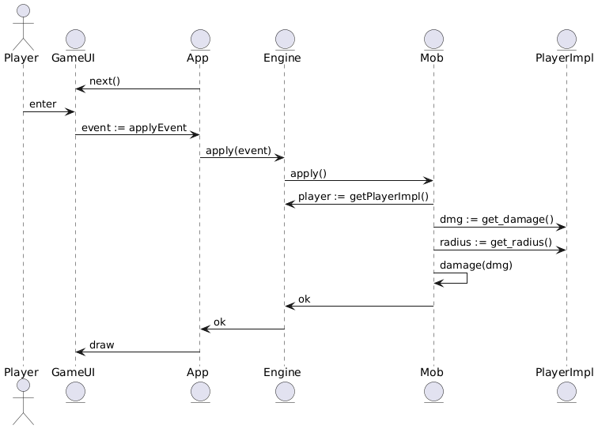

# Roguelike игра

## Сборка

Чтобы собрать игру на unix системах надо позвать `make` в директории roguelike.

## Общие сведения о системе

Система представляет собой консольную roguelike-игру, где игрок взаимодействует с процедурно сгенерированными уровнями, выполняет задачи, сражается с врагами и достигает целей, определённых игровой логикой.

## Architectural Drivers

Функциональные требования:

- Генерация случайных уровней с препятствиями, сокровищами и врагами.

- Управление персонажем через консольные команды.

- Система боя с использованием характеристик персонажа и врагов.

- Сохранение и загрузка прогресса.

Нефункциональные требования:

- Кроссплатформенность (Windows, Linux, macOS).

- Поддержка минимальных системных требований.

- Реакция на действия игрока в реальном времени.

- Масштабируемость игрового процесса (добавление новых врагов, предметов, уровней).

## Роли и случаи использования

### Роли:

- Игрок.

### Случаи использования:

#### Начало новой игры:

- Пользователь выбирает расу.

- Генерируется новый уровень.

- Игрок управляет персонажем через консольные команды (вверх, вниз, атака и т.д.).

##### Альтернативы:

- Случайная генерация нового персонажа с уникальными характеристиками.

- Возможность выбора предварительно сохранённого персонажа.

#### Сражение с врагами:

- Игрок встречает врага на уровне.

- Выбирает действие: атака, использование предмета.

- Система рассчитывает исход боя, основываясь на характеристиках персонажа и врага.

#### Сохранение и загрузка прогресса:

- Игрок сохраняет текущий прогресс через команду меню.

- Восстанавливает игру с последнего сохранения.

##### Альтернативы:

- Автоматическое сохранение при переходе на новый уровень.

- Режим "без сохранений" для сложной игры.

## Диаграмма компонентов

`GameUI` - модуль ответственный за рисование состояния игры в консоли. `AppUI` использует два интерфейса: `Drawer` и `Input`, он абстрагирован от того, какая используется консоль. `Console` кросс-платформенно реализует эти интерфейсы. `AppUI` использует интерфейс `IEngine` для получения игровых сущностей для рисования (игрок, карта, мобы, и тд). `IEngine` также содержит в себе интерфейсы для игровых сущностей.

`GameEngine` реализует `IEngine` и все заявленные там интерфейсы.

`App` контролирует работу компонентов: получает события из `UI` и применяет их к игровому состоянию.

## Диаграмма классов

## Диаграмма последовательностей

### Нанесение урона мобу игроком

`App` зовет `next()` на `GameUI`, он в свою очередь начинает ждать событие от
пользователя. Когда пользователь нажимает `Enter` с наведенной на моба кареткой,
`UI` генерирует событие `ApplyEvent`, далее `App` применяет это событие к движку с помощью `Engine`. `Engine` вызывает `apply` на объекте моба.
Моб получает стейт игрока, определяет расстояние до него от себя, и если оно не
превышает радиус, то вызывает у себя метод `damage`, который и изменяет показания здоровья.
Далее управление возвращается к `App` и происходит перерисовка состояния.

## Поддержанные фичи:

- Движок:
  * Спавн мобов
  * Загрузка мира из файлов
  * Инвентарь, сохраненные предметы
  * Описание поведения мобов с помощью деревьев решений
  * Система уровней, опыта, характеристик
  * Система боя: атака мобами игрока, атака игрока
  * Автоматическая генерация данжей в виде деревьев
  * Возможность перехода в разные данжи, набор карт
- UI:
  * Кросс-платформенная рисование в терминал
  * Рисование всех сущностей движка
  * Рисование каретки для наведения
  * Возможность закрепления каретки на сущности
  * Рисование радиуса атаки сущностей
